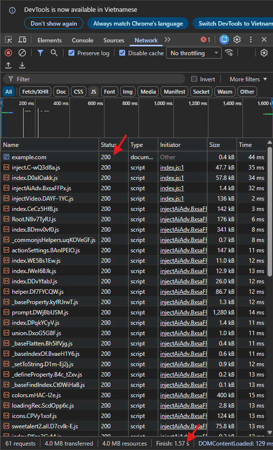
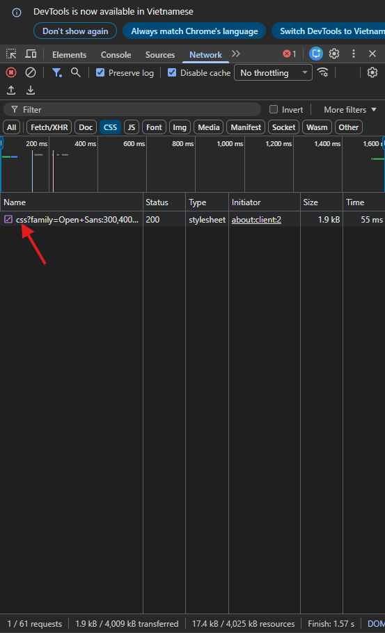
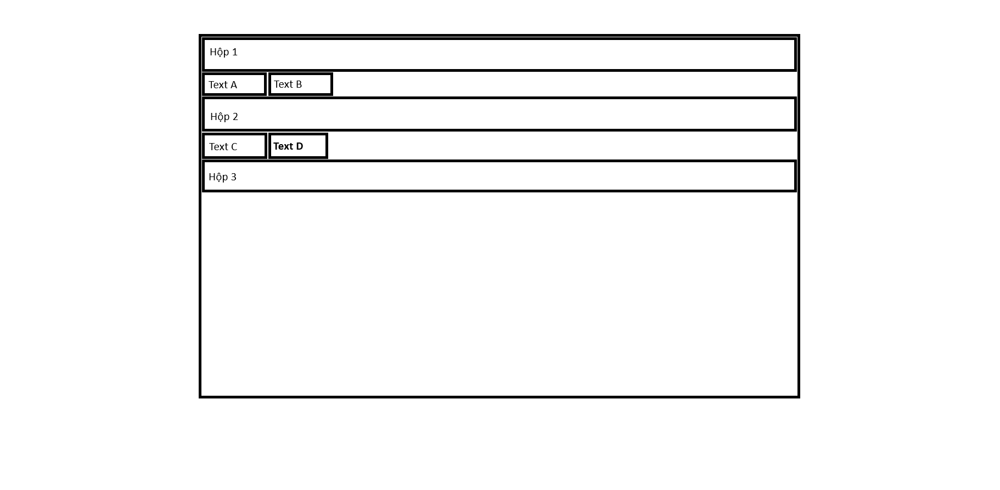
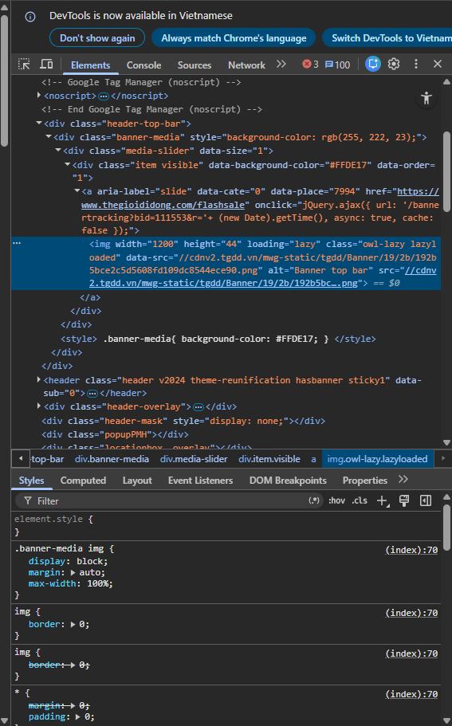
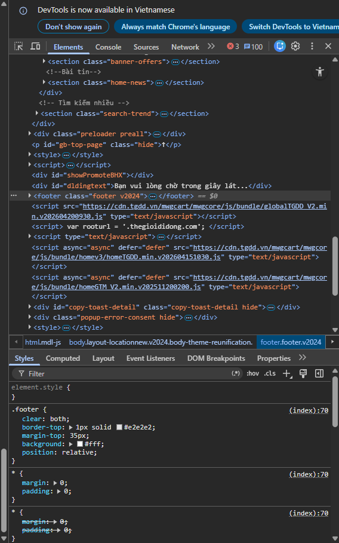
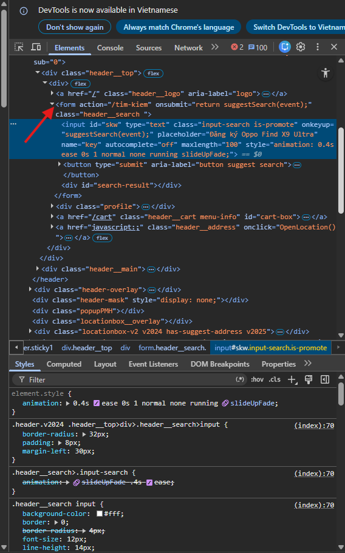

hCâu A1 — HTTP & Browser
1.  
B1: Trình duyệt kiểm tra cache DNS → nếu chưa có thì gửi yêu cầu đến DNS server để phân giải tên miền shopee.vn thành địa chỉ IP.
B2: Trình duyệt thiết lập kết nối TCP với server (3-way handshake).
B3: Nếu là HTTPS, thực hiện TLS handshake để mã hóa kết nối.
B4: Trình duyệt gửi HTTP request (GET /) đến server.
B5: Server xử lý và trả về HTTP response (HTML, CSS, JS, hình ảnh...).
B6: Trình duyệt nhận HTML → parse thành DOM.
B7: Trình duyệt tải các tài nguyên liên quan (CSS, JS, ảnh...).
B8: Xây dựng CSSOM và render tree → tiến hành layout và paint để hiển thị trang web.

2. 

- Status Code request đầu tiên: 200
- Tổng thời gian load trang: 1.57s

Câu A2 — Semantic HTML
Trước khi sửa:

    
ShopTLU

    

        
<a href="/">Trang chủ</a>

        
<a href="/products">Sản phẩm</a>

    

    

        
iPhone 16 Pro

        
25.990.000đ

        

    

© 2026 ShopTLU

Web này bị Google đánh giá SEO thấp vì dùng thẻ 
 cho tất cả 
Website bị Goodle đánh giá SEO thấp vì:
+ sử dụng quá nhiều thẻ div không mang ý nghĩa
Lỗi semantic:
+ phần header dùng thẻ 

+ phần nav dùng thẻ 

+ phần main dùng thẻ 

+ phần product dùng thẻ 

+ không có thuộc tính alt cho ảnh

Sau khi sửa :
<header>
    
ShopTLU

    <nav>
        <a href="/">Trang chủ</a>
        <a href="/products">Sản phẩm</a>
    </nav>
</header>

<main>
    <article class="product">
        <h1>iPhone 16 Pro</h1>
        
25.990.000đ

        
    </article>
</main>

<footer>
    
© 2026 ShopTLU

</footer>

Câu A3 — Block vs Inline

Câu A4
giải thích sự khác nhau giữa <thead>,<tbody>,<tfoot>
<thead> dùng cho tiêu đề cột
<tbody> dùng để chứa phần dữ liệu chính, các bản ghi
<tfoot> dùng để hiện thị tổng kết 

Bài B3 — Debug HTML
Lỗi 1: Dòng 1 - khai báo DOCTYPE không đúng chuẩn - sửa lại thành <!DOCTYPE html>
Lỗi 2: Dòng 4 - <title> không đóng thẻ - bổ sung thẻ đóng <title>Trang web</title>
Lỗi 3: Dòng 5 - utf8 viết sai - sửa lại thành <meata charset="UTF-8">
Lỗi 4: Dòng 8 - thẻ <h1> đóng sai - sửa lại <h1>Welcome to ShopTLU</h1>
Lỗi 5: Dòng 12 - link không hợp lệ href="home" - sửa lại href="#home"
Lỗi 6: Dòng 12 - thẻ <h1> đóng sai - sửa lại <a href="#home">Trang chủ</a>
Lỗi 7: Dòng 20 - thẻ  thuộc tính src thiếu "" và alt - sửa lại 
Lỗi 8: Dòng 22 - đóng sai thứ tự các thẻ - 
Giá: <b>25.990.000đ</b>

Lỗi 9: Dòng 27 - table thiếu thẻ <thead> và <tbody> - thêm vào <thead> và <tbody>
Lỗi 10: Dòng 29 - dùng <td> cho header - dùng <th> cho header của bảng
Lỗi 11: Dòng 40 - dùng 2 <main> - bỏ thẻ <main> thay bằng <aside> vì <aside> thường được dùng làm thanh bên để chứa danh mục bài viết
Lỗi 12: Dòng 45 - không đóng thẻ 
 - đóng thẻ 
 thành 
Coryright 2026

Lỗi 13: Thiếu <html lang="vi>
Lỗi 14: Thiếu <meta view="viewport" content="width=device-width, initial-scale=1.0">
Lỗi 15: Thiếu thẻ đóng </html> - thêm thẻ đóng </html>

Bài B4 — Phân tích trang web thật
1. Trang web: thegioididong.com
- Thẻ  ở đầu trang 
- Thẻ <h1> ở đầu trang 
- Thẻ <header> cũng ở phần đầu trang 
- Thẻ <footer> ở cuối trang 
2. 
- Không tìm thấy <table> được sử dụng trong trang web
3. 

- action: /timkiem
- method: GET (mặc định)
- input types: text

